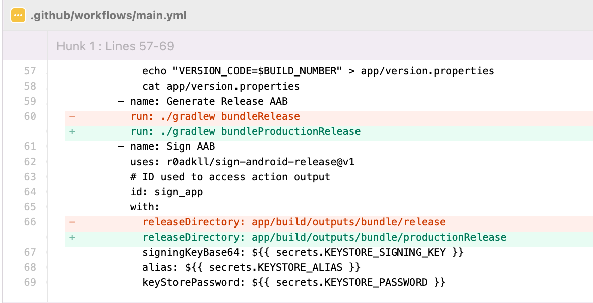

<!--
SPDX-FileCopyrightText: NOI Techpark <digital@noi.bz.it>

SPDX-License-Identifier: CC0-1.0
-->

# NOI-Community App for Android

[](https://github.com/noi-techpark/it.bz.noi.community.android/actions/workflows/main.yml)

The NOI-Community App is your information and communication channel to keep in
touch with the growing innovation district of NOI Techpark and its members. Are
you looking for a specific company that is working here? Do you need to book a
room for your next team meeting? Or do you simply want to know today's choice of
dishes in the Community Bar? From now on, you can find all that in one
application. More tools to come, so stay tuned!

We have also an [App for
iOS](https://github.com/noi-techpark/it.bz.noi.community.ios).

**Table of Contents**
- [NOI-Community App for Android](#noi-community-app-for-android)
	- [Getting started](#getting-started)
		- [Prerequisites](#prerequisites)
		- [Source code](#source-code)
		- [Configure the project](#configure-the-project)
	- [Running tests](#running-tests)
	- [Deployment](#deployment)
		- [Variants](#variants)
		- [How to check the application version?](#how-to-check-the-application-version)
	- [Information](#information)
		- [Support](#support)
		- [Contributing](#contributing)
		- [License](#license)

## Getting started

These instructions will get you a copy of the project up and running
on your local machine for development and testing purposes.

### Prerequisites

To build the project, the following prerequisites must be met:

1. [Android Studio](https://developer.android.com/studio) is strongly recommended,
   even if any other IDE that supports Android projects should be fine
2. Gradle (tested with v6.5)


### Source code

Get a copy of the repository:

```bash
git clone git@github.com:noi-techpark/it.bz.noi.community.android.git
```

### Configure the project

No configuration is needed.

## Running tests

The unit tests can be executed with the following command launched from the project folder:

```bash
./gradlew clean
./gradlew test
```

*More information about Android tests at https://developer.android.com/studio/test/command-line*

## Deployment

We deploy the application with Github Actions to a Test Track, if someone pushes
to the `main` branch. See
[.github/workflows/main.yml](.github/workflows/main.yml) and [Continuous
Deployment for Android Apps] for details.

Go to https://play.google.com/console to configure the Alpha channel releases.

If the App is still an older version on your phone, please consider to go to
https://play.google.com/store/apps/details?id=it.bz.noi.community, which opens
the Google Play Store and see if it provides a manual update.

### Variants
We have two different build variants:
- `development` -> uses testing machine authentication flow
- `production` -> uses production authentication flow

Eventually change the CI/CD job `build_and_deploy_to_play_store` to use production authentication flow:



If you want to generate an app bundle for testing machine use case, you have to execute `./gradlew bundleDevelopmentRelease` command and retrieve the `.aab` file from `app/build/outputs/bundle/developmentRelease` directory.

Similarly, if you want to generate the app file instead of the bundle:
- _development_
      - command: `./gradlew assembleDevelopmentRelease`
      - directory: `app/build/outputs/bundle/apk/development/release`
- _production_
      - command: `./gradlew assembleProductionRelease`
      - directory: `app/build/outputs/bundle/apk/production/release`

I left invariant the two tests jobs. From Gradle tasks documentation, we have that:
- test: Run unit tests for all variants
- connectedAndroidTest - Installs and runs instrumentation tests for all flavors on connected devices

If you want to run tests only for a specific variant, you can change the relative job with these possibilities:

`unit_tests` job:
- testDevelopmentDebugUnitTest - Run unit tests for the developmentDebug build.
- testDevelopmentReleaseUnitTest - Run unit tests for the developmentRelease build.
- testProductionDebugUnitTest - Run unit tests for the productionDebug build.
- testProductionReleaseUnitTest - Run unit tests for the productionRelease build.

`android_tests` job:
- connectedDevelopmentDebugAndroidTest - Installs and runs the tests for developmentDebug on connected devices.
- connectedProductionDebugAndroidTest - Installs and runs the tests for productionDebug on connected devices.

### How to check the application version?
Open the app and go to "More". You find the actual version under the NOI logo,
where the first three numbers represent the semantic version and the last the
timestamp of the release.

For example: `0.1.0.1649084864`, means that we have a version `0.1.0` released
on `Mon Apr 04 2022 17:07:44 GMT+0200 (Central European Summer Time)`. You can
use https://www.unixtimestamp.com/ for conversions.

[Continuous Deployment for Android Apps]: https://github.com/noi-techpark/odh-docs/wiki/Continuous-Deployment-for-Android-Apps

## Information

### Support

For support, please contact [help@opendatahub.bz.it](mailto:help@opendatahub.bz.it).

### Contributing

If you'd like to contribute, please follow our [Getting
Started](https://github.com/noi-techpark/odh-docs/wiki/Contributor-Guidelines:-Getting-started)
instructions.

### License

The code in this project is licensed under the GNU GENERAL PUBLIC LICENSE 3.0 or
later license. See the LICENSE file for more information.
